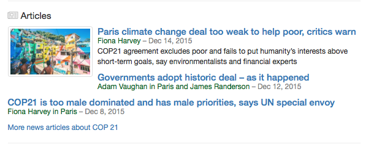

UX patterns for findability
===

Templates for **search front ends** and **reporting tools** that allow you to **find what you’re looking for**.

The initial template can be viewed [here](http://bit.ly/results-mock-up-snapshot-feb-2016), as hosted on Dropbox.

At inception this repository is a single template for a search engine result page («[SERP](https://en.wikipedia.org/wiki/Search_engine_results_page)») created my me (Bjørn T). Over time hopefully a library for [UX](https://en.wikipedia.org/wiki/User_experience_design)-driven [findability](https://en.wikipedia.org/wiki/Findability) maintained by, among others, you.

> 
>
>*A disambiguation result, inspired by Google’s OneBoxes, allowing the user to state her intent.*

Tons of stuff is missing, including media assets. Bear with me as I learn myself the basics of GutHub.

Why?
---

**The pain: Your client’s employees can’t find what they’re looking for.** When developing enterprise search solutions over the last 10 years, my experience has consistently been that features crucial to findability never make it into the actual services. With rotten findability (1) the entire content/knowledge management solution loses its usefulness. 

**The response: At first, [a template](http://bit.ly/results-mock-up-snapshot-feb-2016) around which to have a conversation about UX and findability.** This repository tries to address the problem by being a starting point for teams building enterprise search solutions, showing UX and findability best practices, with an emphasis on:

* Disambiguation through 1) Result groups and 2) Autocomplete topics
* User influenced relevancy & findability
* User added results & sources
* Editorial maintenance
* Findability reporting
 
More on these points [below](#focus-areas).

This project is in its infancy, so as of March ’16 it’s just a seed for a conversation. If we’re lucky it can become a [Pattern Lab](http://patternlab.io)-based library of components that can make a difference in enterprise content/knowledge management – and hopefully other search solutions.

<small>(1) Often 20% or worse in the «[unstructured data](https://en.wikipedia.org/wiki/Unstructured_data) behind the firewall» scenario.</small>

Focus areas
===

Disambiguation
---
**…through 1) Result groups and 2) Autocomplete topics**

To [disambiguate](https://en.wikipedia.org/wiki/Word-sense_disambiguation) is to identify the meaning of a word when the word has multiple meanings.

Best of breed search services (read: Google) uses multiple strategies to understand what a user really means. Some of these strategies are expressed as user experiences, and one of the best, the «[Google OneBox](http://searchengineland.com/meet-the-google-onebox-plus-box-direct-answers-the-10-pack-26706)», asks the user what content type she wants while framing the question as a set of example results. This strategy is obviously battle-tested literally billions of times per day through the main Google.com result page. And consider this: Even if you don’t click a OneBox, it is *still* valuable to you, because it took and entire category you wasn’t currently looking for, and put all those results inside a single one.

However, although Google left the «10 blue links» concept behind more than 15 years ago, many «behind the firewall» solutions today are still lack this basic, yet extremely useful disambiguation strategy. Most enterprise search engines, Elasticsearch and SharePoint included (2), do not support the concept «out of the box». The [initial template](http://bit.ly/results-mock-up-snapshot-feb-2016) therefore focuses heavily on these types of results.

A similar strategy should be used for the autocomplete when allowed. E.g., if the content is divided into topic sections, evaluate showing these in the autocomplete. See the template for examples.

<small>(2) SharePoint has OneBox results for employees out of the box. This is a huge findability win. In many installations is the only part of the SharePoint search that has user trust. However, I’m primarily focusing on the «unstructured data» part of enterprise search, and in that area, SharePoint consistently has very poor performance.</small>

User influenced relevancy & findability
---
**Including user added results & sources**

A paradox: In general, an enterprise’s employees are not allowed by their knowledge management system to help each other find content that they have created themselves.

In the case of SharePoint, since its inception 15 years ago, it’s primary function has been to be the sum of Office documents created by an organization’s employees. For most of these years, it has supported the concept of «[best bets](https://support.office.com/en-us/article/Add-keyword-terms-with-Best-Bets-f18c2a69-e975-4be2-9139-52dce9d8d026)». Best bets allow a small clique of so-called «Site Collection Administrators» to respond to a very limited set of queries with recommended results. 

In the same timespan, Wikipedia, Stack Overflow, Reddit and a ton of other highly successful services have shown that users (3) are great at moderating content – also in the [long tail](https://en.wikipedia.org/wiki/Long_tail) – when allowed. But does SharePoint and most other enterprise search solutions allow regular users to influence the ranking of results – on a document collection they have created themselves? Regrettably: No. 

In most enterprise search solutions it’s impossible for a user to explicitly inform the system about the usefulness of any given result. The only thing that is derived from user behaviour is the «clickthrough» measurement. Some providers, such as [Vivisimo](http://www-01.ibm.com/software/data/information-optimization/) (now part of IBM Watson Explorer), allowed users to vote results up or down. Sadly, Vivisimo seems to be among the exceptions.

Over time, I'll provide interfaces that illustrate how user added results and user influenced relevancy should be incorporated into vanilla knowledge management solutions.

<small>(3) Here’s a really crazy thing: The users that are allowed to moderate Wikipedia and the like, are non-paid people that frequently operate under pseudonyms and who mostly don’t know each other. In SharePoint however, you have people who’s on the payroll to contribute to the company, but they are not trusted to give each other a helping hand in uncovering content.</small>

Editorial maintenance
---
In a work, editorial maintenance for enterprise search *sucks*. Admittedly, I mostly have experience with SharePoint. But there are a *lot* of businesses running their knowledge management solutions on that platform. I have illustrations to use as a conversation starter and hope to upload them during the spring of ’16.

Findability reporting
---
Knowledge management is regarded as a critical success factor by many boards. However, the metrics they are served, if any, are shallow and glean too little insight. Let’s change that. Findability reporting should be transparent and actionable, available to everyone – from the individual employee, through team leaders and evangelists, all the way to the board.

**Do you have documentation** of an enterprise search actually providing useful and trusted findability for unstructured data behind the firewall? Please get in touch and let me know! Big thanks in advance :-)

Not a focus
===

Technical relevancy
---
There are a ton of resources covering this topic. It is the main focus area of all of the search providers. I’ll just add a single opinion: For publicly available textual («unstructured») content, [Google Custom Search](https://cse.google.com/) (CSE) will yield the best technical relevancy in the majority of the cases. I wouldn’t consider challenging them. However, their presentation can be improved significantly, most notably with result groups, which CSE does not offer but which is used abundantly by Google.com, setting user expectations. So my suggestion is to use CSE for public, unstructured content, Elasticsearch (or your preferred alternative) for other sources, and hopefully this framework (as a basis) for presentation.

Visual esthetics
---
This is an important aspect of any user-facing service, but again, it’s well covered elsewhere. This repository concerns itself with *the user experience aspects of findability*, or, said differently, «how can we help improve findability by thinking smart about the user experience».

Last, I would love your help in improving the goals here, so please get in touch or make commits as you please.
